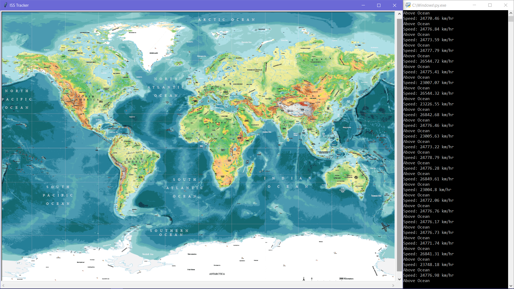

## ISS Tracker
Tracking International Space Station using NASA's API and plotting its location on the world map using turtle library.

## Requirements
- Python 3
- Pip (Python's Package Manager)

## Installation
- First, clone the repository.
```
git clone https://github.com/daspartho/iss-tracker.git 
```
- Then, change your current directory into the iss-tracker repository.
```
cd iss-tracker
```
- install geopy Library
```
pip install geopy
```

## Usage
Run the script from a terminal using
```
python main.py
```
## Showcase


## Contributing
If you want to contribute code, just write a quick pull request and the developers will take a look at it.
If you want to suggest an idea, just write an issue and the developers will check it out!
